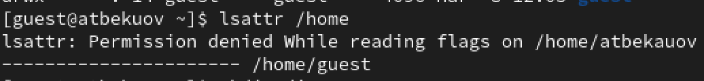
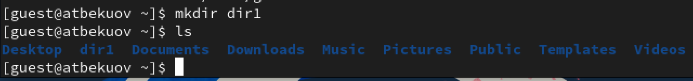
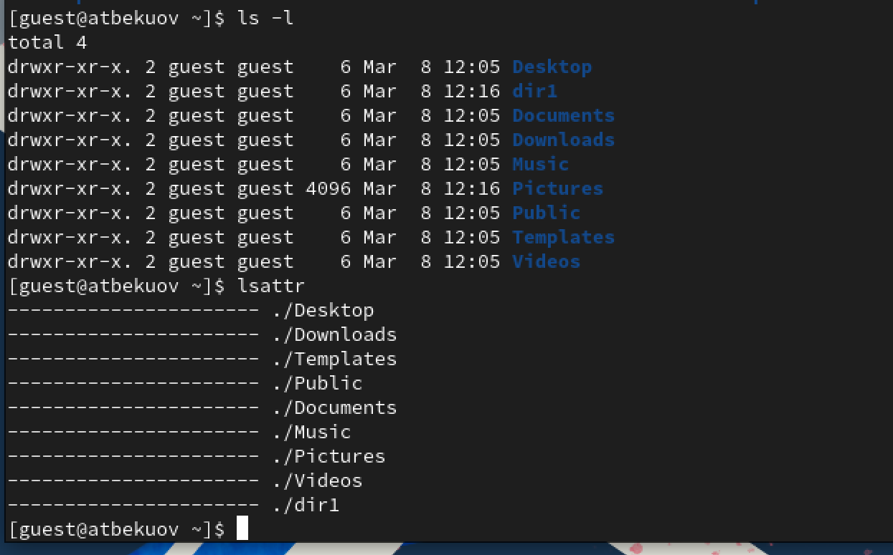
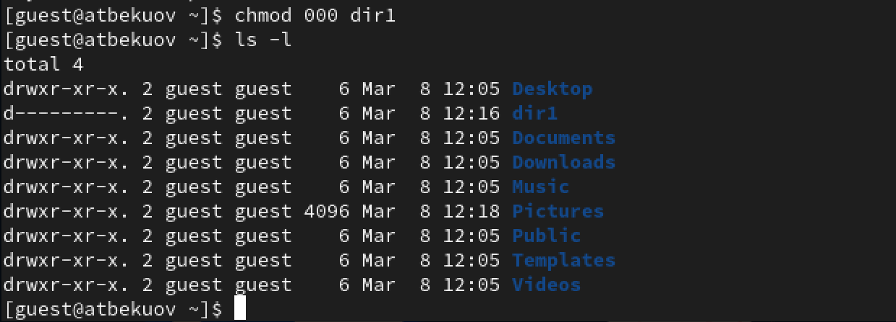
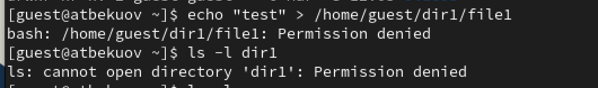
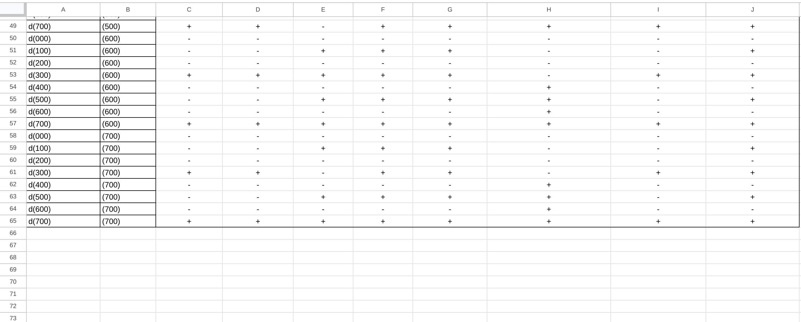

---
## Front matter
lang: ru-RU
title: Лабораторная работа №2
subtitle: Основы информационной безопасности
  - Бекауов А.Т
institute:
  - Российский университет дружбы народов, Москва, Россия

## i18n babel
babel-lang: russian
babel-otherlangs: english

## Formatting pdf
toc: false
toc-title: Содержание
slide_level: 2
aspectratio: 169
section-titles: true
theme: metropolis
header-includes:
 - \metroset{progressbar=frametitle,sectionpage=progressbar,numbering=fraction}
 - '\makeatletter'
 - '\beamer@ignorenonframefalse'
 - '\makeatother'

##Fonts
mainfont: PT Serif
romanfont: PT Serif
sansfont: PT Sans
monofont: PT Mono
mainfontoptions: Ligatures=TeX
romanfontoptions: Ligatures=TeX
sansfontoptions: Ligatures=TeX,Scale=MatchLowercase
monofontoptions: Scale=MatchLowercase,Scale=0.9
---

# Введение

## Цель работы

Цель данной лабораторной работы получение практических навыков работы в консоли с атрибутами файлов, закрепление теоретических основ дискреционного разграничения доступа в современных системах с открытым кодом на базе ОС Linuxы

# Выполнение лабораторной работы

## Создание пользователя guest

Первым делом создаю в учётную запись пользователя guest с помощью команды sudo useradd guest и введя passwd guest задаю пароль, для созданного пользователя

{#fig:001 width=70%}

## Проверка домашней директории и имени пользователя

Захожу под пользователем guest и ввожу в терминале команду pwd, чтобы определить нахожусь в домашней директории, затем ввожу whoami, чтобы убедиться, что я в пользователе guest

{#fig:002 width=70%}

## Сравнение gid и groups, uid и имени

Далее ввожу команду id, получая gid (group id) и uid (user id). Сравниваю их с выводом команды groups и именем пользователя в приглашении командной строки

{#fig:003 width=70%}

## cat

Далее просматриваю файл /etc/passwd командой cat /etc/passwd.

{#fig:004 width=70%}

## guest в /etc/passwd

Нахожу там пользователя guest и сравниваю информацию в нём с полученными uid и gid.

{#fig:005 width=70%}

## Поддирекрии директории /home

С помощью команды ls -l /home, получаю список поддиректорий каталога /home. Вижу, что права доступа разрешают пользователю запись, чтение и исполнение, а группе и остальным - всё запрещено.

{#fig:006 width=70%}

## Вывод команды lsattr /home

С помощью команды lsattr /home проверю, какие расширенные атрибуты установлены на поддиректориях, находящихся в директории /home.

{#fig:007 width=70%}

## Создание папки dir1

Командой mkdir создаю директорию dir1 в домашнем каталоге guest.

{#fig:008 width=70%}

## Права доступа к dir1

Введя команды ls -l и lsattr, определю права доступа к dir1.

{#fig:009 width=70%}

## Изменение прав доступа к dir1

Сниму с директории dir1 все атрибуты командой chmod. Затем проверю изменения введя ls -l

{#fig:010 width=70%}

## Содержимое папки dir1

Попытаюсь создать в директории dir1 файл file1. Получаю отказ, если заглянуть внутрь папки dir1,  вижу что и файл file1 создан не был.

{#fig:011 width=70%}

## Таблица 1(1)
{#fig:012 width=100%}

## Таблица 1(1)

{#fig:013 width=100%}

## Таблица 1(1)

{#fig:014 width=100%}

## Таблица 2

{#fig:015 width=100%}

# Заключение

## Выводы

В ходе данной лаботраторной работы я полученил практические навыки работы в консоли с атрибутами файлов, закрепил теоретические основы дискреционного разграничения доступа в современных системах с открытым кодом на базе ОС Linux

