---
## Front matter
title: "Отчёт по лабораторной работе №2"
subtitle: "Основы информационной безопасности"
author: "Бекауов Артур Тимурович"

## Generic otions
lang: ru-RU
toc-title: "Содержание"

## Bibliography
bibliography: bib/cite.bib
csl: pandoc/csl/gost-r-7-0-5-2008-numeric.csl

## Pdf output format
toc: true # Table of contents
toc-depth: 2
lof: true # List of figures
lot: true # List of tables
fontsize: 12pt
linestretch: 1.5
papersize: a4
documentclass: scrreprt
## I18n polyglossia
polyglossia-lang:
  name: russian
  options:
	- spelling=modern
	- babelshorthands=true
polyglossia-otherlangs:
  name: english
## I18n babel
babel-lang: russian
babel-otherlangs: english
## Fonts
mainfont: PT Serif
romanfont: PT Serif
sansfont: PT Sans
monofont: PT Mono
mainfontoptions: Ligatures=TeX
romanfontoptions: Ligatures=TeX
sansfontoptions: Ligatures=TeX,Scale=MatchLowercase
monofontoptions: Scale=MatchLowercase,Scale=0.9
## Biblatex
biblatex: true
biblio-style: "gost-numeric"
biblatexoptions:
  - parentracker=true
  - backend=biber
  - hyperref=auto
  - language=auto
  - autolang=other*
  - citestyle=gost-numeric
## Pandoc-crossref LaTeX customization
figureTitle: "Рис."
tableTitle: "Таблица"
listingTitle: "Листинг"
lofTitle: "Список иллюстраций"
lotTitle: "Список таблиц"
lolTitle: "Листинги"
## Misc options
indent: true
header-includes:
  - \usepackage{indentfirst}
  - \usepackage{float} # keep figures where there are in the text
  - \floatplacement{figure}{H} # keep figures where there are in the text
---

# Цель работы

Цель данной лабораторной работы получение практических навыков работы в консоли с атрибутами файлов, закрепление теоретических основ дискреционного разграничения доступа в современных системах с открытым кодом на базе ОС Linux.

# Выполнение лабораторной работы

Первым делом создаю в учётную запись пользователя guest с помощью команды sudo useradd guest и введя passwd guest задаю пароль, для созданного пользователя.  (рис. [-@fig:001]).

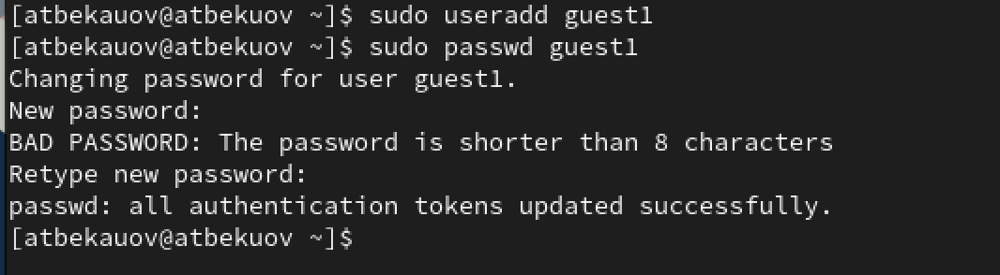{#fig:001 width=70%}

Захожу под пользователем guest и ввожу в терминале команду pwd, чтобы определить нахожусь в домашней директории, затем ввожу whoami, чтобы убедиться, что я в пользователе guest.(рис. [-@fig:002]).

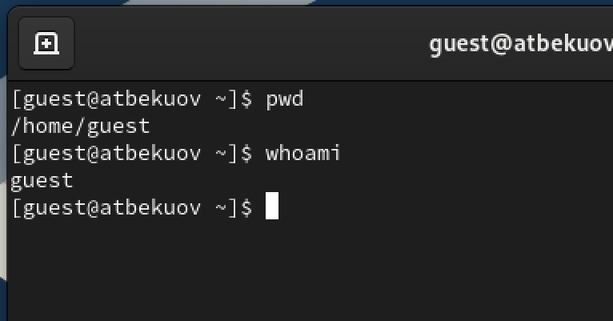{#fig:002 width=70%}

Далее ввожу команду id, получая gid (group id) и uid (user id). Сравниваю их с выводом команды groups и именем пользователя в приглашении командной строки.(рис. [-@fig:003]).

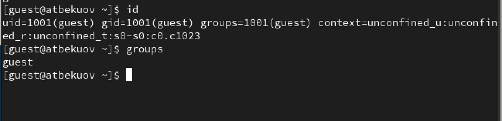{#fig:003 width=70%}

Далее просматриваю файл /etc/passwd командой cat /etc/passwd. (рис. [-@fig:004]).

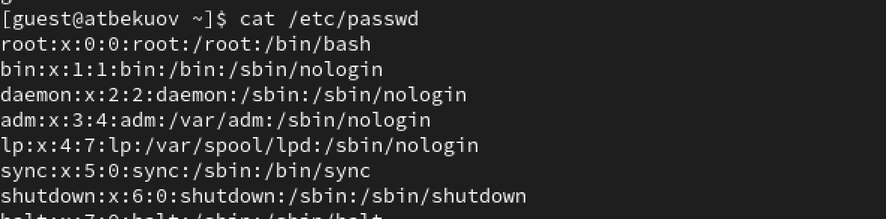{#fig:004 width=70%}

Нахожу там пользователя guest и сравниваю информацию в нём с полученными uid и gid. (рис. [-@fig:005]).

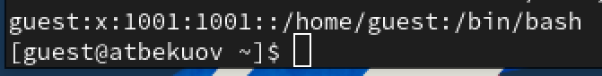{#fig:005 width=70%}

С помощью команды ls -l /home, получаю список поддиректорий каталога /home. Вижу, что права доступа разрешают пользователю запись, чтение и исполнение, а группе и остальным - всё запрещено.  (рис. [-@fig:006]).

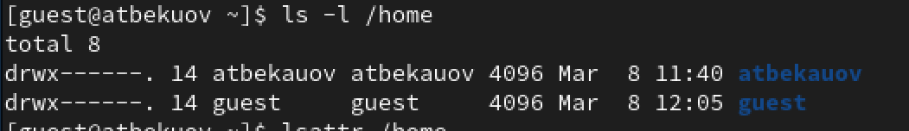{#fig:006 width=70%}

С помощью команды lsattr /home проверю, какие расширенные атрибуты установлены на поддиректориях, находящихся в директории /home. Увидеть расширенные атрибуты директории /home/guest увидеть удалось, а других пользователей - нет, т.к было отказано в доступе. (рис. [-@fig:007]).

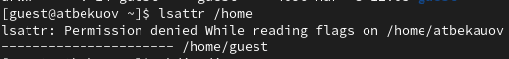{#fig:007 width=70%}

Командой mkdir создаю директорию dir1 в домашнем каталоге guest.  (рис. [-@fig:008]).

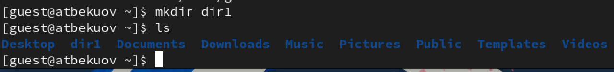{#fig:008 width=70%}

Введя команды ls -l и lsattr, определю права доступа к dir1. (рис. [-@fig:009]).

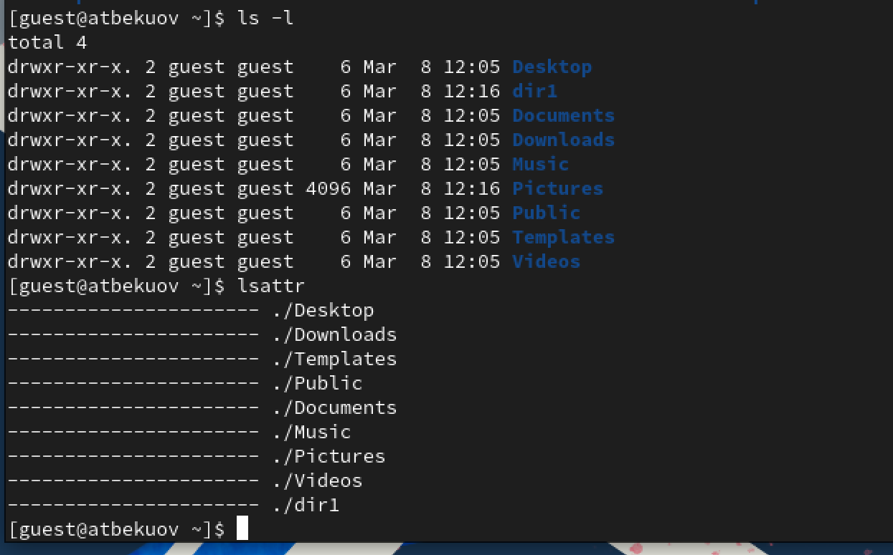{#fig:009 width=70%}

Сниму с директории dir1 все атрибуты командой chmod. Затем проверю изменения введя ls -l. (рис. [-@fig:010]). 

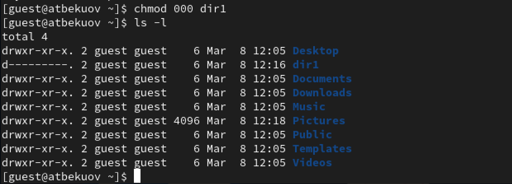{#fig:010 width=70%}

Попытаюсь создать в директории dir1 файл file1 командой echo "test" > /home/guest/dir1/file1. Получаю отказ, т.к у меня нет прав изменять директорию (даже просматривать её содержимое), если заглянуть внутрь папки dir1,  вижу что и файл file1 создан не был (не говоря уже о его изменении командой echo). (рис. [-@fig:011]). 

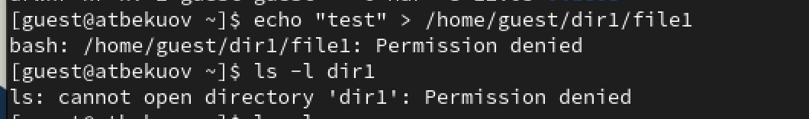{#fig:011 width=70%}

Далее заполню таблицу 1, о влиянии атрибутов на возможность взамодействия с файлами и директориями. (рис. [-@fig:012], [-@fig:013], [-@fig:014]). 

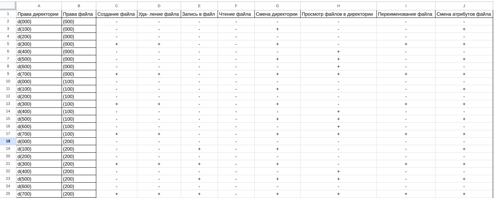{#fig:012 width=100%}

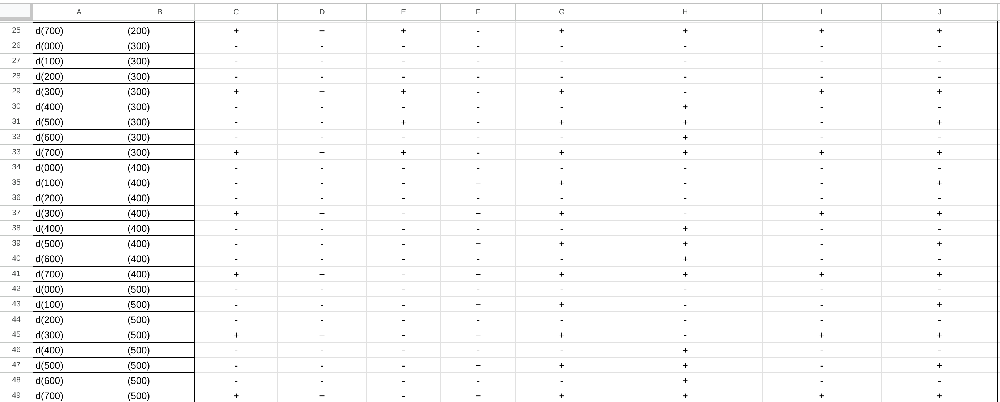{#fig:013 width=100%}

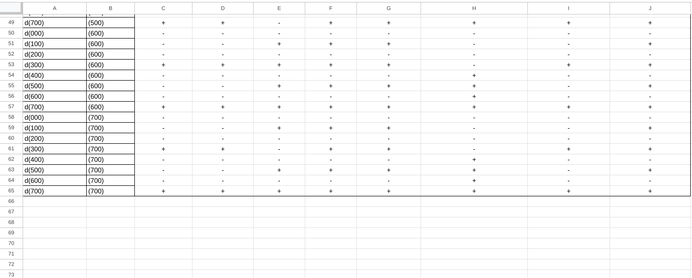{#fig:014 width=100%}

Затем заполню таблицу 2 о минимальных правах, необходимых для совершения операций. (рис. [-@fig:015]). 

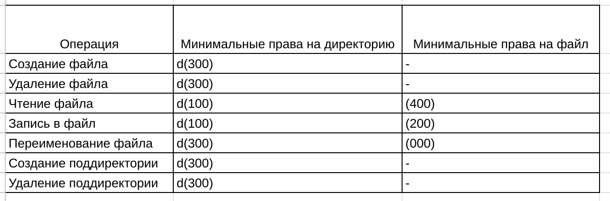{#fig:015 width=100%}

# Выводы

В ходе данной лаботраторной работы я полученил практические навыки работы в консоли с атрибутами файлов, закрепил теоретические основы дискреционного разграничения доступа в современных системах с открытым кодом на базе ОС Linux

