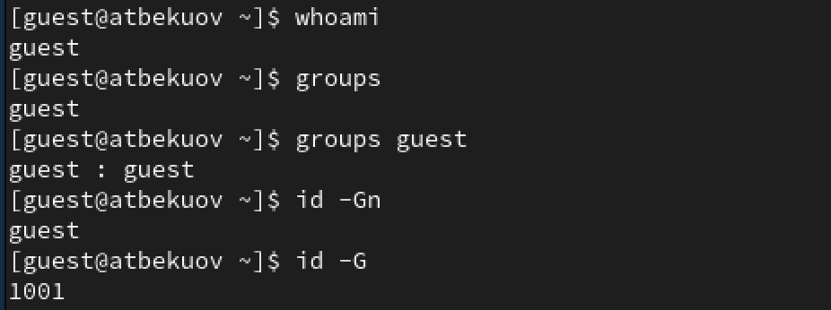
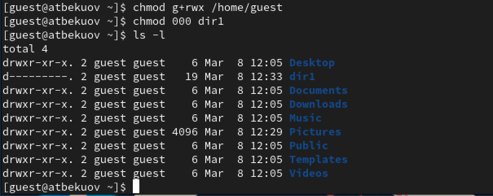
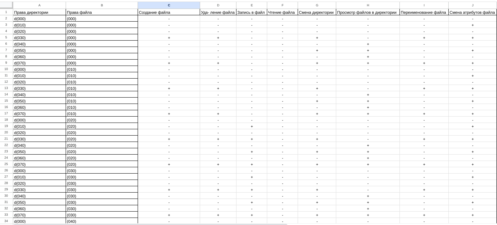
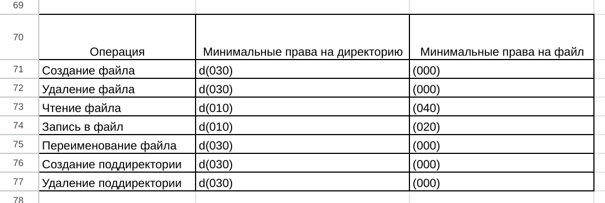

---
## Front matter
lang: ru-RU
title: Лабораторная работа №3
subtitle: Основы информационной безопасности
  - Бекауов А.Т
institute:
  - Российский университет дружбы народов, Москва, Россия

## i18n babel
babel-lang: russian
babel-otherlangs: english

## Formatting pdf
toc: false
toc-title: Содержание
slide_level: 2
aspectratio: 169
section-titles: true
theme: metropolis
header-includes:
 - \metroset{progressbar=frametitle,sectionpage=progressbar,numbering=fraction}
 - '\makeatletter'
 - '\beamer@ignorenonframefalse'
 - '\makeatother'

##Fonts
mainfont: PT Serif
romanfont: PT Serif
sansfont: PT Sans
monofont: PT Mono
mainfontoptions: Ligatures=TeX
romanfontoptions: Ligatures=TeX
sansfontoptions: Ligatures=TeX,Scale=MatchLowercase
monofontoptions: Scale=MatchLowercase,Scale=0.9
---

# Введение

## Цель работы

Цель данной лабораторной работы - получение практических навыков работы в консоли с атрибутами файлов для групп пользователей.

# Выполнение лабораторной работы

## Создание пользователя guest2

Учётная запись guest уже была создана во 2-ой лабораторной работе, потому создаю пользователя guest2, и задаю ему пароль 

{#fig:001 width=70%}

## Добавление пользователя в группу

Далее добавляю пользователя guest2 в группу guest.

{#fig:002 width=70%}

## Вход в guest

Затем в терминальном окне захожу в пользователя guest и сразу проверяю в какой директории нахожусь с помощью команды pwd. Нахожусь в домашней директории пользователя guest

{#fig:003 width=70%}

## Вход в guest2

Открываю новое окно терминала и проделываю всё то же самое для пользователя guest2. Каталог соответственно - домашняя папка guest2

{#fig:004 width=70%}

## Группы пользователя guest

За пользователя guest проверяю имя пользователя и группы, к которым он принадлежит. Вижу, что имя пользователя - guest, принадлежит он к единственной группе - guest(1001). 

{#fig:005 width=70%}

## Группы пользователя guest2

Проделываю всё то же за пользователя guest2. Имя - guest2; группы - guest(1001), guest2(1002). 

{#fig:006 width=70%}

## Вывод команды cat /etc/groups

С помощью команды cat /etc/groups проверяю, что написано в /etc/groups. Вижу, что в группе guest(1001) присутствует пользователь guest2 (помимо естественно guest).

{#fig:007 width=70%}

## Регистрация пользователя в группе

От имени пользователя guest2 выполню регистрацию пользователя guest 2 в группе group (командой newgrp guest).

{#fig:008 width=70%}

## Изменения прав доступа к /home/guest  и dir1

Далее от имени guest, предоставляю группе все права на директорию /home/guest, а затем отбираю все права (у всех) на директорию dir1. Проверяю с помощью команды ls.

{#fig:009 width=70%}

## Создание таблицы

Далее заполню таблицу 1, о влиянии атрибутов на возможность пользователей группы взамодействовать с файлами и директориями.

## Таблица 1(1)
{#fig:011 width=100%}

## Таблица 1(2)

{#fig:012 width=100%}

## Таблица 2

Затем заполню таблицу 2 о минимальных правах, необходимых для совершения операций.

{#fig:013 width=100%}

# Заключение

## Выводы

В ходе данной лаботраторной работы я получил практические навыки работы в консоли с атрибутами файлов для групп пользователей

