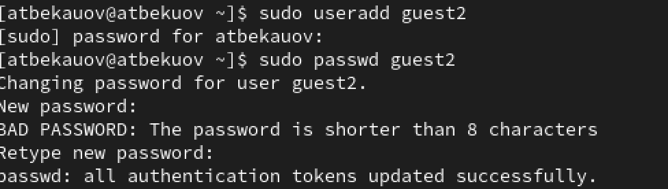
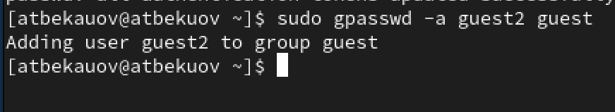
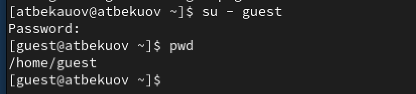
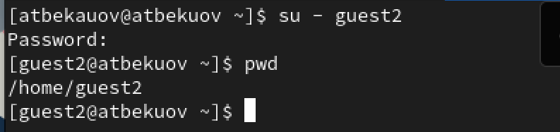
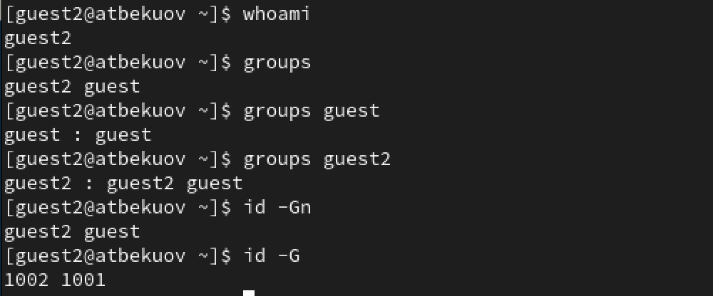
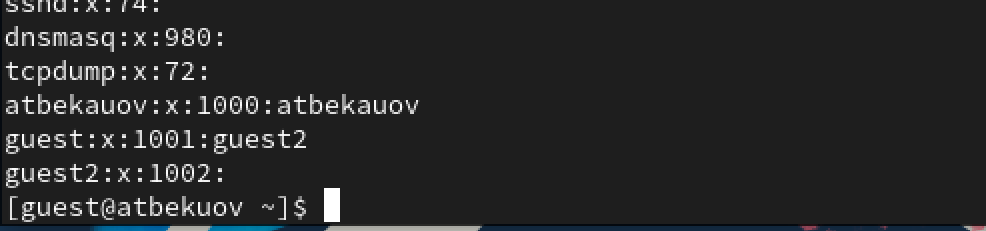
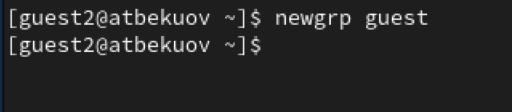
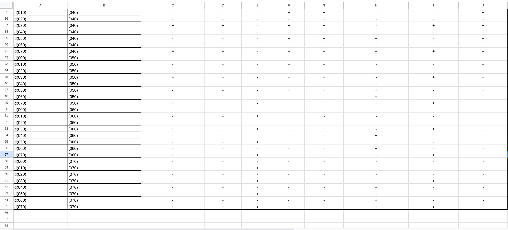

---
## Front matter
title: "Отчёт по лабораторной работе №3"
subtitle: "Основы информационной безопасности"
author: "Бекауов Артур Тимурович"

## Generic otions
lang: ru-RU
toc-title: "Содержание"

## Bibliography
bibliography: bib/cite.bib
csl: pandoc/csl/gost-r-7-0-5-2008-numeric.csl

## Pdf output format
toc: true # Table of contents
toc-depth: 2
lof: true # List of figures
lot: true # List of tables
fontsize: 12pt
linestretch: 1.5
papersize: a4
documentclass: scrreprt
## I18n polyglossia
polyglossia-lang:
  name: russian
  options:
	- spelling=modern
	- babelshorthands=true
polyglossia-otherlangs:
  name: english
## I18n babel
babel-lang: russian
babel-otherlangs: english
## Fonts
mainfont: PT Serif
romanfont: PT Serif
sansfont: PT Sans
monofont: PT Mono
mainfontoptions: Ligatures=TeX
romanfontoptions: Ligatures=TeX
sansfontoptions: Ligatures=TeX,Scale=MatchLowercase
monofontoptions: Scale=MatchLowercase,Scale=0.9
## Biblatex
biblatex: true
biblio-style: "gost-numeric"
biblatexoptions:
  - parentracker=true
  - backend=biber
  - hyperref=auto
  - language=auto
  - autolang=other*
  - citestyle=gost-numeric
## Pandoc-crossref LaTeX customization
figureTitle: "Рис."
tableTitle: "Таблица"
listingTitle: "Листинг"
lofTitle: "Список иллюстраций"
lotTitle: "Список таблиц"
lolTitle: "Листинги"
## Misc options
indent: true
header-includes:
  - \usepackage{indentfirst}
  - \usepackage{float} # keep figures where there are in the text
  - \floatplacement{figure}{H} # keep figures where there are in the text
---

# Цель работы

Цель данной лабораторной работы - получение практических навыков работы в консоли с атрибутами файлов для групп пользователей.

# Выполнение лабораторной работы

Учётная запись guest уже была создана во 2-ой лабораторной работе, потому создаю пользователя guest2, и задаю ему пароль (рис. [-@fig:001]).

{#fig:001 width=70%}

Далее добавляю пользователя guest2 в группу guest.(рис. [-@fig:002]).

{#fig:002 width=70%}

Затем в терминальном окне захожу в пользователя guest и сразу проверяю в какой директории нахожусь с помощью команды pwd. Нахожусь в домашней директории пользователя guest(рис. [-@fig:003]).

{#fig:003 width=70%}

Открываю новое окно терминала и проделываю всё то же самое для пользователя guest2. Каталог соответственно - домашняя папка guest2 (рис. [-@fig:004]).

{#fig:004 width=70%}

За пользователя guest проверяю имя пользователя и группы, к которым он принадлежит. Вижу, что имя пользователя - guest, принадлежит он к единственной группе - guest(1001). (рис. [-@fig:005]).

{#fig:005 width=70%}

Проделываю всё то же за пользователя guest2. Имя - guest2; группы - guest(1001), guest2(1002).  (рис. [-@fig:006]).

{#fig:006 width=70%}

С помощью команды cat /etc/groups проверяю, что написано в /etc/groups. Вижу, что в группе guest(1001) присутствует пользователь guest2 (помимо естественно guest).  (рис. [-@fig:007]).

{#fig:007 width=70%}

От имени пользователя guest2 выполню регистрацию пользователя guest 2 в группе group (командой newgrp guest).  (рис. [-@fig:008]).

{#fig:008 width=70%}

Далее от имени guest, предоставляю группе все права на директорию /home/guest, а затем отбираю все права (у всех) на директорию dir1. Проверяю с помощью команды ls. (рис. [-@fig:009]).

{#fig:009 width=70%}

Далее заполню таблицу 1, о влиянии атрибутов на возможность пользователей группы взамодействовать с файлами и директориями. (рис. [-@fig:011], [-@fig:012]) 

{#fig:011 width=100%}

{#fig:012 width=100%}

Затем заполню таблицу 2 о минимальных правах, необходимых для совершения операций. (рис. [-@fig:013]). 

{#fig:013 width=100%}

# Выводы

В ходе данной лаботраторной работы я получил практические навыки работы в консоли с атрибутами файлов для групп пользователей

