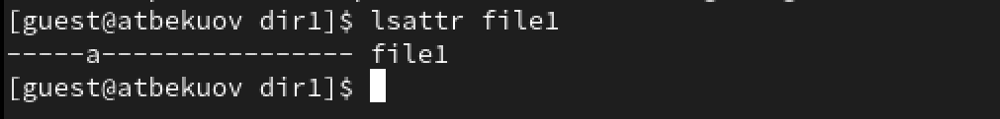
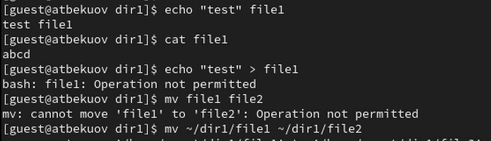
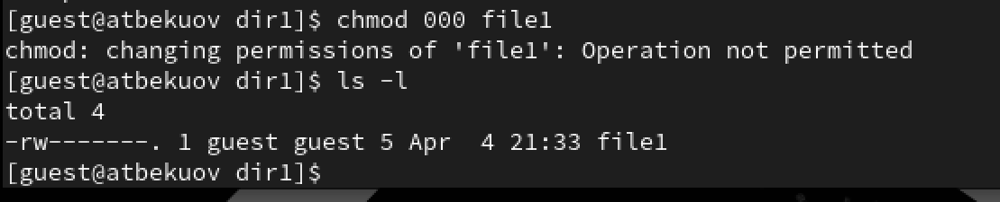
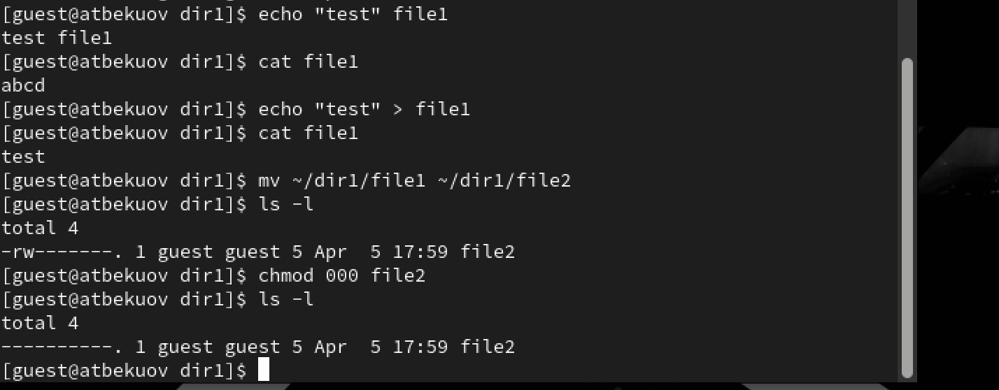
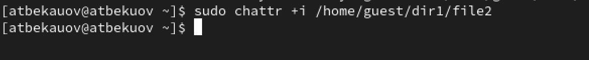
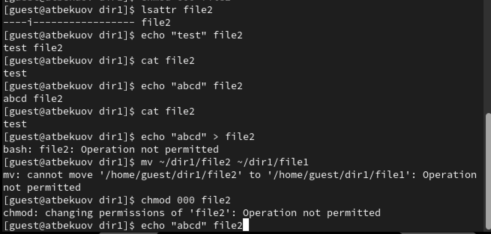

---
## Front matter
title: "Отчёт по лабораторной работе №6"
subtitle: "Основы информационной безопасности"
author: "Бекауов Артур Тимурович"

## Generic otions
lang: ru-RU
toc-title: "Содержание"

## Bibliography
bibliography: bib/cite.bib
csl: pandoc/csl/gost-r-7-0-5-2008-numeric.csl

## Pdf output format
toc: true # Table of contents
toc-depth: 2
lof: true # List of figures
lot: true # List of tables
fontsize: 12pt
linestretch: 1.5
papersize: a4
documentclass: scrreprt
## I18n polyglossia
polyglossia-lang:
  name: russian
  options:
	- spelling=modern
	- babelshorthands=true
polyglossia-otherlangs:
  name: english
## I18n babel
babel-lang: russian
babel-otherlangs: english
## Fonts
mainfont: PT Serif
romanfont: PT Serif
sansfont: PT Sans
monofont: PT Mono
mainfontoptions: Ligatures=TeX
romanfontoptions: Ligatures=TeX
sansfontoptions: Ligatures=TeX,Scale=MatchLowercase
monofontoptions: Scale=MatchLowercase,Scale=0.9
## Biblatex
biblatex: true
biblio-style: "gost-numeric"
biblatexoptions:
  - parentracker=true
  - backend=biber
  - hyperref=auto
  - language=auto
  - autolang=other*
  - citestyle=gost-numeric
## Pandoc-crossref LaTeX customization
figureTitle: "Рис."
tableTitle: "Таблица"
listingTitle: "Листинг"
lofTitle: "Список иллюстраций"
lotTitle: "Список таблиц"
lolTitle: "Листинги"
## Misc options
indent: true
header-includes:
  - \usepackage{indentfirst}
  - \usepackage{float} # keep figures where there are in the text
  - \floatplacement{figure}{H} # keep figures where there are in the text
---

# Цель работы

Цель данной лабораторной работы - получение практических навыков работы в консоли с расширенными атрибутами файлов.

# Выполнение лабораторной работы

От имени пользователя guest определим расширенные атрибуты файла dir1/file1. Затем командой chmod на файл file 1 устанавливаю права разрешающие чтение и запись для владельца файла. (рис. [-@fig:001]).

{#fig:001 width=70%}

Далее попытаюсь изменить расширенные атрибуты file1 от имени пользователя guest. Попытка неудачная - отказано в доступе (рис. [-@fig:002]).

{#fig:002 width=70%}

После этого захожу на вторую консоль под именем администратора, и добавляю к file1 аттрибут a (рис. [-@fig:003]).

{#fig:003 width=70%}

От пользователя guest проверяю правильность установления атрибутов (рис. [-@fig:004]).

{#fig:004 width=70%}

Далее проверяю возможеость выполнения следующих действий: дозапись в файл (выполнено), чтение файла (выполнено), стирание информации (отказано в доступе), переименование файла (отказано в доступе). (рис. [-@fig:005]).

{#fig:005 width=70%}

Попробую установить на файл file1 права 000 с атрибутом a. Отказано в доступе  (рис. [-@fig:006]).

{#fig:006 width=70%}

Снимем атрибут а с файла file1 от имени администратора.  (рис. [-@fig:007]).

{#fig:007 width=70%}

Проверяем все те же действия без атрибута а: дозапись в файл (выполнено), чтение файла (выполнено), стирание информации (выполнено), переименование файла (выполнено), изменение прав на файл (выполнено).  (рис. [-@fig:008]).

{#fig:008 width=70%}

Далее от имени администратора добавляю к файлу file1 атрибут i (рис. [-@fig:009]).

{#fig:009 width=70%}

Далее проверяю выполнение указанных выше операций с атрибутом i: дозапись в файл (провалено), чтение файла (выполнено), стирание информации (отказано), переименование файла (отказано), изменение прав на файл (отказано). (рис. [-@fig:010])

{#fig:010 width=70%}

# Выводы

В ходе данной лаботраторной работы я получил практические навыки работы в консоли с расширенными атрибутами файлов.

