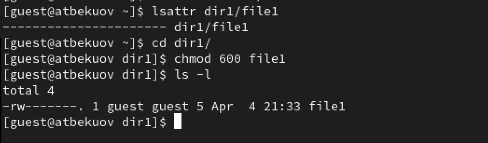
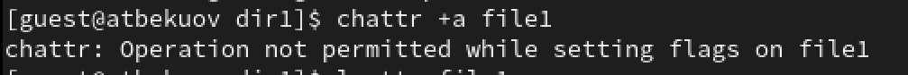
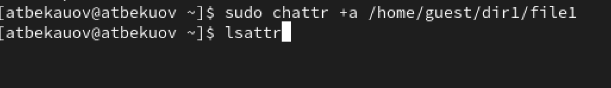
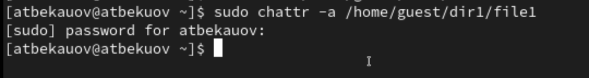

---
## Front matter
lang: ru-RU
title: Лабораторная работа №7
subtitle: Основы информационной безопасности
  - Бекауов А.Т
institute:
  - Российский университет дружбы народов, Москва, Россия

## i18n babel
babel-lang: russian
babel-otherlangs: english

## Formatting pdf
toc: false
toc-title: Содержание
slide_level: 2
aspectratio: 169
section-titles: true
theme: metropolis
header-includes:
 - \metroset{progressbar=frametitle,sectionpage=progressbar,numbering=fraction}
 - '\makeatletter'
 - '\beamer@ignorenonframefalse'
 - '\makeatother'

##Fonts
mainfont: PT Serif
romanfont: PT Serif
sansfont: PT Sans
monofont: PT Mono
mainfontoptions: Ligatures=TeX
romanfontoptions: Ligatures=TeX
sansfontoptions: Ligatures=TeX,Scale=MatchLowercase
monofontoptions: Scale=MatchLowercase,Scale=0.9
---

# Введение

## Цель работы

Цель данной лабораторной работы - получение практических навыков работы в консоли с расширенными атрибутами файлов.

# Выполнение лабораторной работы

## Редактирование прав file1

От имени пользователя guest определим расширенные атрибуты файла dir1/file1. Затем командой chmod на файл file 1 устанавливаю права разрешающие чтение и запись для владельца файла.

{#fig:001 width=70%}

## Попытка изменения атрибутов file1 от имени guest

Далее попытаюсь изменить расширенные атрибуты file1 от имени пользователя guest. Попытка неудачная - отказано в доступе

{#fig:002 width=70%}

## Изменение атрибутов file1 от имени администратора

После этого захожу на вторую консоль под именем администратора, и добавляю к file1 аттрибут a

{#fig:003 width=70%}

## Проверка рассширенных атрибутов file1

От пользователя guest проверяю правильность установления атрибутов

{#fig:004 width=70%}

## Проверка выполнения операций (с аттрибутом a)

Далее проверяю возможеость выполнения следующих действий: дозапись в файл (выполнено), чтение файла (выполнено), стирание информации (отказано в доступе), переименование файла (отказано в доступе). 

{#fig:005 width=70%}

## Изменение прав на файл (c атрибутом a)

Попробую установить на файл file1 права 000 с атрибутом a. Отказано в доступе 

{#fig:006 width=70%}

## Снятие атрибута a c file1

Снимем атрибут а с файла file1 от имени администратора.

{#fig:007 width=70%}

## Проверка выполнения операций (без атрибута а)

Проверяем все те же действия без атрибута а: дозапись в файл (выполнено), чтение файла (выполнено), стирание информации (выполнено), переименование файла (выполнено), изменение прав на файл (выполнено).

{#fig:008 width=70%}

## Добавление атрибута i на file1

Далее от имени пользователя с правами администратора добавил атрибут i на файл file1

{#fig:009 width=70%}

## Проверка выполнения операций (с атрибутом i)

Далее проверяю выполнение указанных выше операций с атрибутом i: дозапись в файл (провалено), чтение файла (выполнено), стирание информации (отказано), переименование файла (отказано), изменение прав на файл (отказано).

{#fig:010 width=70%}

# Заключение

## Выводы

В ходе данной лаботраторной работы я получил практические навыки работы в консоли с расширенными атрибутами файлов.

