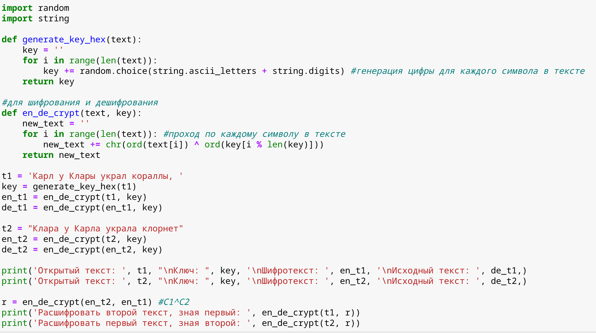
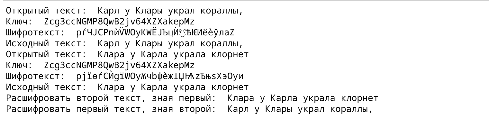

---
## Front matter
lang: ru-RU
title: Лабораторная работа №8
subtitle: Основы информационной безопасности
  - Бекауов А.Т
institute:
  - Российский университет дружбы народов, Москва, Россия

## i18n babel
babel-lang: russian
babel-otherlangs: english

## Formatting pdf
toc: false
toc-title: Содержание
slide_level: 2
aspectratio: 169
section-titles: true
theme: metropolis
header-includes:
 - \metroset{progressbar=frametitle,sectionpage=progressbar,numbering=fraction}
 - '\makeatletter'
 - '\beamer@ignorenonframefalse'
 - '\makeatother'

##Fonts
mainfont: PT Serif
romanfont: PT Serif
sansfont: PT Sans
monofont: PT Mono
mainfontoptions: Ligatures=TeX
romanfontoptions: Ligatures=TeX
sansfontoptions: Ligatures=TeX,Scale=MatchLowercase
monofontoptions: Scale=MatchLowercase,Scale=0.9
---

# Введение

## Цель работы

Цель данной лабораторной работы - освоить на практике применение режима однократного гаммирования на примере кодирования различных исходных текстов одним ключом

# Выполнение лабораторной работы

## Программа

Используя функцию для генерации ключа, генерирую ключ, затем шифрую два разных текста одним и тем же ключом 

{#fig:001 width=70%}

## Вывод программы

Расшифровываю оба текста сначала с помощью одного ключа, затем предполагаю, что мне неизвестен ключ, но извествен один из текстов и уже расшифровываю второй, зная шифротексты и первый текст

{#fig:002 width=70%}

# Заключение

## Выводы

В ходе данной лаботраторной работы я освоил на практике применение режима однократного гаммирования на примере кодирования различных исходных текстов одним ключом.

