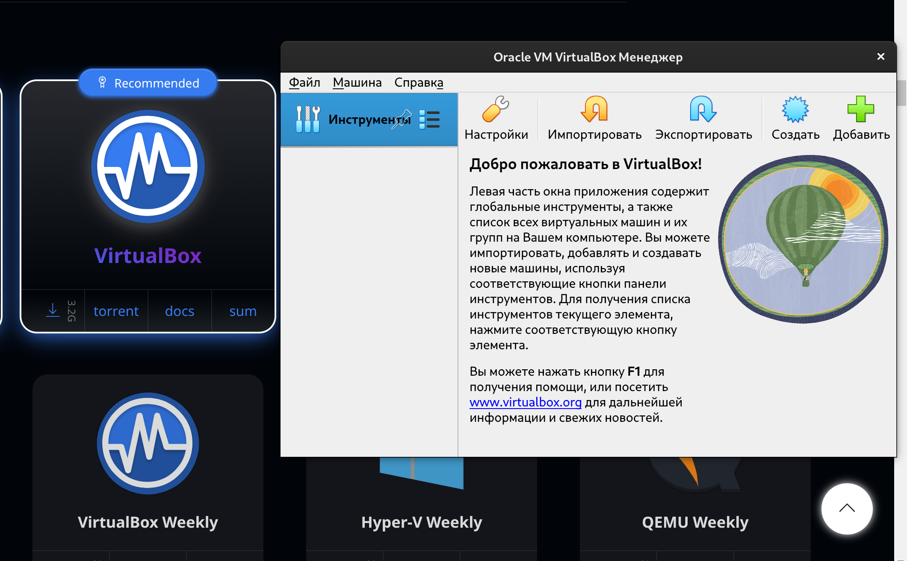
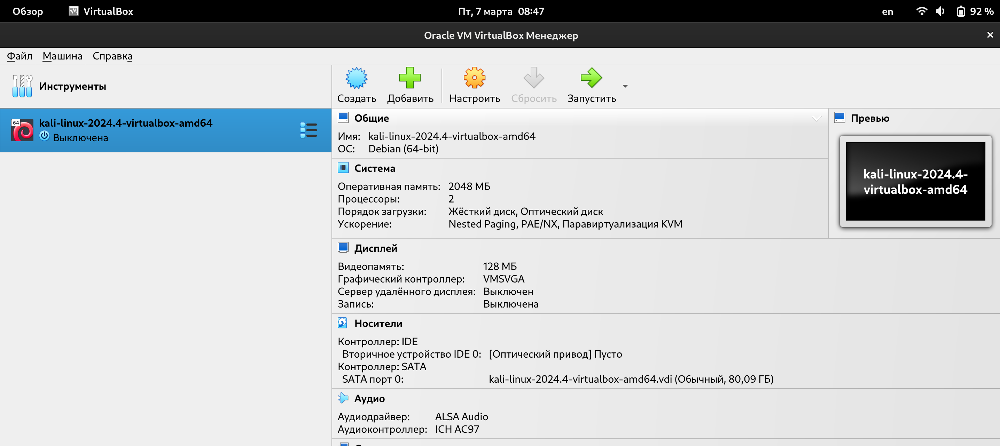
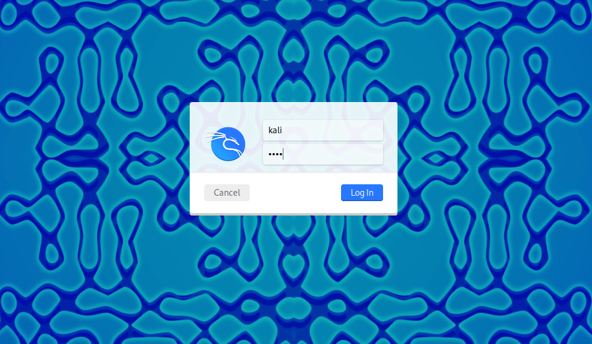
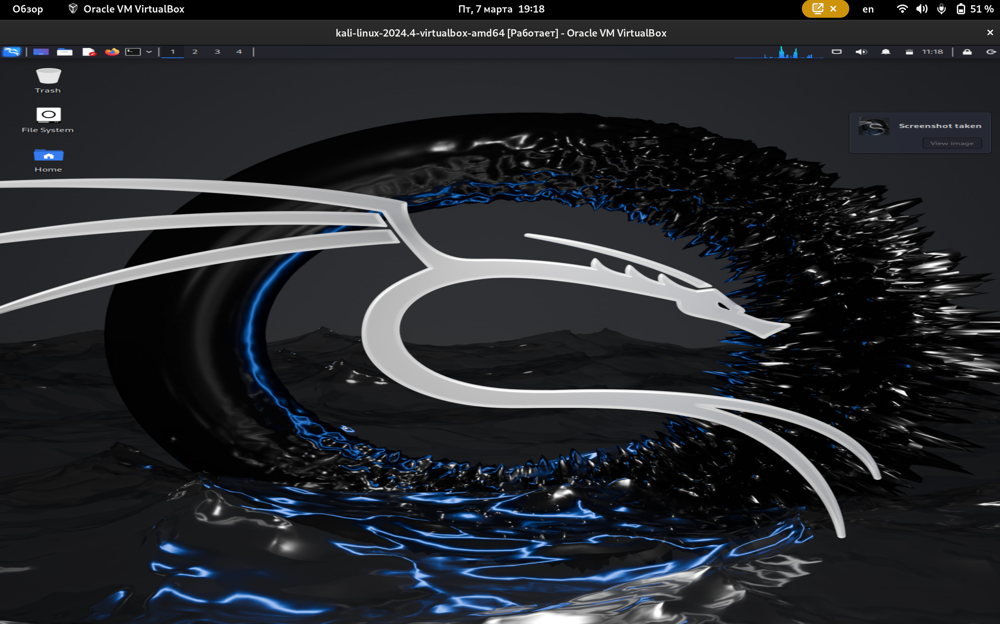

---
## Front matter
lang: ru-RU
title: Первый этап Индивидуального проекта
subtitle: Основы информационной безопасности
  - Бекауов А.Т
institute:
  - Российский университет дружбы народов, Москва, Россия

## i18n babel
babel-lang: russian
babel-otherlangs: english

## Formatting pdf
toc: false
toc-title: Содержание
slide_level: 2
aspectratio: 169
section-titles: true
theme: metropolis
header-includes:
 - \metroset{progressbar=frametitle,sectionpage=progressbar,numbering=fraction}
 - '\makeatletter'
 - '\beamer@ignorenonframefalse'
 - '\makeatother'

##Fonts
mainfont: PT Serif
romanfont: PT Serif
sansfont: PT Sans
monofont: PT Mono
mainfontoptions: Ligatures=TeX
romanfontoptions: Ligatures=TeX
sansfontoptions: Ligatures=TeX,Scale=MatchLowercase
monofontoptions: Scale=MatchLowercase,Scale=0.9
---

# Введение

## Цель работы

Цель данной работы научиться основным способам тестирования веб приложений. Выполнить первый этап индивидуального проекта.

# Выполнение лабораторной работы

## Загрузка образа Kali linux

Первым делом, убедившись, что на моём устройстве установлен VirtualBox, захожу на сайт https://www.kali.org/  и загружаю образ ОС для запуска на виртуальных машинах.

{#fig:001 width=70%}

## Виртуальная машина

Распаковываем архив с образом ОС и добавляем его в VirtualBox.

{#fig:002 width=70%}

## Вход в пользователя

Запускаем виртуальную машину и заходим в kali linux с логином и паролем по умолчанию (kali - kali).

{#fig:003 width=70%}

## Запуск Kali linux

Захожу в Kali и завершаю первый этап индивидуального проекта.

{#fig:004 width=70%}

# Заключение

## Выводы

В ходе данной работы я установил на своё устройство дистрибутив kali Linux и выполнил первый этап индивидуального проекта.

